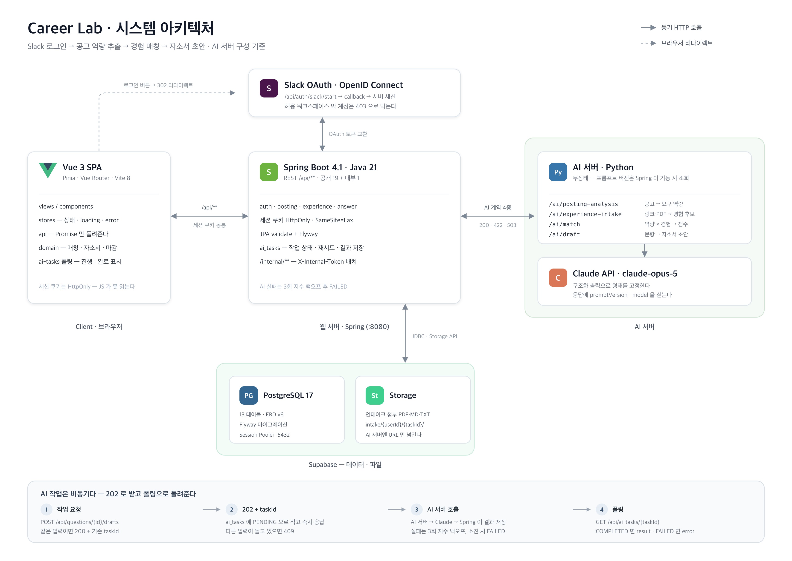

# Career Lab

내 경험(STAR)을 쌓아 두고, 채용 공고의 요구 역량과 맞춰 보고, 자소서를 쓰는 곳.

Slack 로그인 → 공고에서 요구 역량 추출 → 내 경험과 매칭(점수 · 갭) → 문항에 맞는 자소서 초안까지 이어진다.
`frontend/`(Vue 3) · `backend/`(Spring Boot) · `ai/`(FastAPI, Claude 또는 Mock) 세 서버로 구성된다.

| 영역 | 스택 |
|---|---|
| Web | Vue 3 · Pinia · Vue Router · Vite 8 (Node 24) |
| API | Spring Boot 4.1 · Java 21 · JPA · Flyway |
| AI | FastAPI · Python 3.13 · Claude(claude-opus-5) |
| Data | PostgreSQL 17 · Supabase (DB · Storage) |
| Auth | Slack OAuth (OpenID Connect) · 서버 세션 쿠키 |

## 바로 띄우기

```bash
docker compose -f compose.yaml -f compose.localdb.yaml up --build
```

<http://localhost:5173> 으로 들어간다. Supabase 를 쓰려면 `cp .env.example .env` 뒤 값을 채우고 `docker compose up --build`.
버전 표준·로컬 개발·함정은 [docs/dev-environment.md](docs/dev-environment.md).

## 아키텍처



- **frontend** — Vue 3 · Pinia · Vue Router · Vite. 세션 쿠키(HttpOnly)로 인증, AI 작업은 폴링으로 진행 상태를 받는다.
- **backend** — Spring Boot 4.1(Java 21). `/api/**` REST, Slack OAuth 세션, Flyway 마이그레이션, AI 작업 큐(재시도 3회 후 FAILED).
- **ai** — FastAPI. `ANTHROPIC_API_KEY`가 있으면 Claude, 없으면 Mock으로 뜬다. 공고 분석·경험 인테이크·매칭(결정론 공식)·초안 4개 계약을 제공한다.
- **db** — PostgreSQL 17(Supabase, 로컬은 Docker 오버레이). 첨부파일은 Supabase Storage.

## 문서

| 문서 | 내용 |
|---|---|
| [docs/dev-environment.md](docs/dev-environment.md) | 버전 표준(Java 21 · Node 24 · Python 3.13 · Postgres 17) · Docker · 로컬 개발 |
| [docs/api-spec-v6.md](docs/api-spec-v6.md) | API 명세. DTO 모양과 오류 코드는 여기가 기준 |
| [docs/erd-v6.dbml](docs/erd-v6.dbml) | ERD (dbdiagram.io) |
| [docs/slack-oauth.md](docs/slack-oauth.md) | 로그인 계약 · Slack App 설정 · 무엇을 막고 있나 |
| [docs/frontend-architecture.md](docs/frontend-architecture.md) | 프론트 계층 · 목/실제 API 전환 |
| [Figma — High Fidelity Wireframe](https://www.figma.com/design/qetQIc6YbBadKfWJyjB6E5/Career-Lab-%E2%80%94-High-Fidelity-Wireframe?node-id=0-1) | 화면 설계. 구현과 어긋나면 여기가 기준 |
| [ai/README.md](ai/README.md) | AI 서버 4개 계약 · 프롬프트 버저닝 · Claude/Mock 전환 |
| [docs/backend-convention.md](docs/backend-convention.md) · [docs/git-convention.md](docs/git-convention.md) | 코드 · 브랜치 · PR 규칙 |
